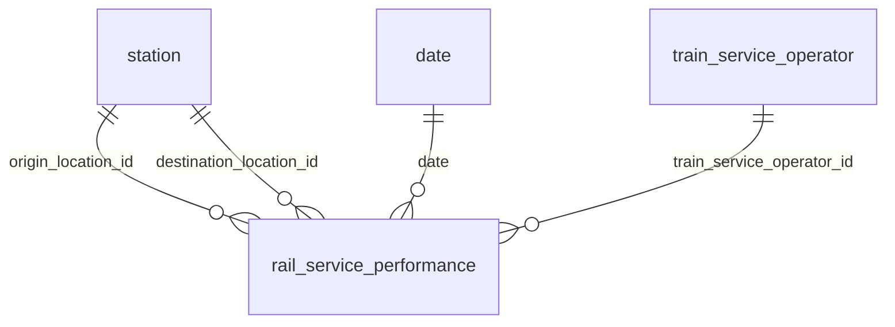
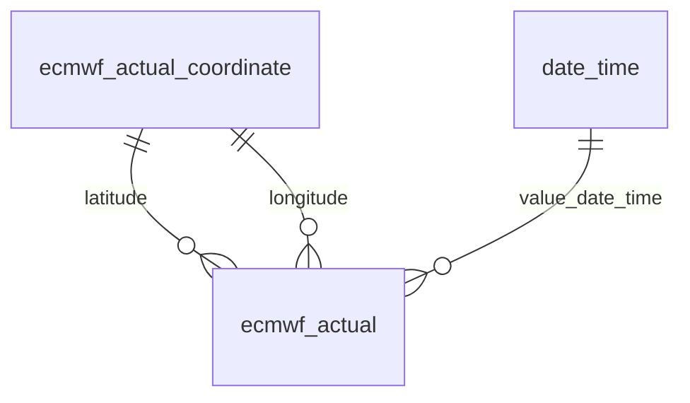
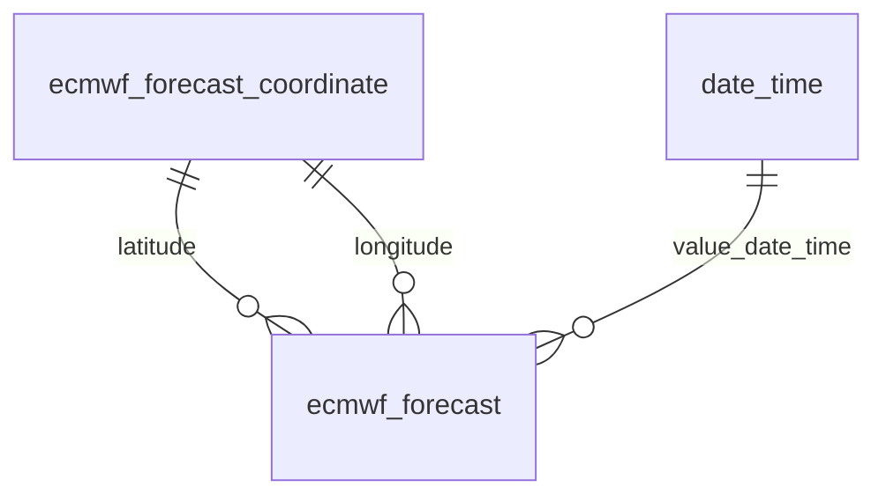

# Udacity Data Engineering Capstone Project
Repository for Udacity Data Engineering capstone project.

## Introduction
The capstone project of Udacity's [Data Engineering](https://www.udacity.com/course/data-engineer-nanodegree--nd027) requires students to combine knowledge learned in the program to build a front to end solution covering the essential elements in data engineering.

This project gathers three data sets:
* Britain's national rail [historic service performance (HSP)](https://wiki.openraildata.com/index.php/HSP)
* European Centre for Medium-Range Weather Forecasts (ECMWF) [ERA5 hourly data](https://cds.climate.copernicus.eu/cdsapp#!/dataset/reanalysis-era5-single-levels?tab=overview)
* ECMWF [open data](https://www.ecmwf.int/en/forecasts/datasets/open-data)

The data extract, transform and load (ETL) pipeline is implemented using Apache [Airflow](https://airflow.apache.org/). Data is stored on an instance of [Amazon Redshift](https://aws.amazon.com/redshift/).

## Data Sets
Railway is important public transport system in Britain. Delays or cancellations cause inconvenience to a lot of railway users, especially the commuters. [Darwin](https://www.nationalrail.co.uk/100296.aspx) is rail industry's official training running information engine which provides not only real-time data, but also history service performance.

The disruptions can be caused by a lot of factors, such as over running engineering work, industrial actions, public holidays, weather, etc. Weather can bring impacts to railway in different ways. Severe weather conditions may damage railway signalling system or cause landslides and fallen trees on the tracks. Even a wrong kind of sunlight can cause delays as reported in this [news story](https://www.theguardian.com/uk-news/2016/jan/12/wrong-kind-of-sunlight-delays-southeastern-trains-london) from Guardian!

This project gathers three data sets including rail historic service performance and weather actual and forecast data. With the performance and weather actual data, data users may discover how weather conditions can affect train service performance. If such discovery achieved, the weather forecast data can be used for prediction. Or we may need more data for finding out the links between more factors and performance. This is the beginning of a journey :smile:!

### Rail Service Performance
Rail service performance data set is collected by registering an account at [Darwin](https://www.nationalrail.co.uk/100296.aspx). This [wiki](https://wiki.openraildata.com/index.php/HSP) page provides details about API access and data format. The data is in json format as:
```json
{
  "header": {
    "from_location": "BTN",
    "to_location": "VIC"
  },
  "Services": [
    {
      "serviceAttributesMetrics": {
        "origin_location": "BTN",
        "destination_location": "VIC",
        "gbtt_ptd": "0712",
        "gbtt_pta": "0823",
        "toc_code": "GX",
        "matched_services": "1",
        "rids": [ "201607013361753" ]
      },
      "Metrics": [
        {
          "tolerance_value": "0",
          "num_not_tolerance": "0",
          "num_tolerance": "1",
          "percent_tolerance": "100",
          "global_tolerance": true
        },
        {
          "tolerance_value": "5",
          "num_not_tolerance": "0",
          "num_tolerance": "1",
          "percent_tolerance": "100",
          "global_tolerance": false
        }
      ]
    },
    {
      "serviceAttributesMetrics": {
        "origin_location": "BTN",
        "destination_location": "VIC",
        "gbtt_ptd": "0729",
        "gbtt_pta": "0839",
        "toc_code": "GX",
        "matched_services": "1",
        "rids": [ "201607013361763" ]
      },
      "Metrics": [
        {
          "tolerance_value": "0",
          "num_not_tolerance": "1",
          "num_tolerance": "0",
          "percent_tolerance": "0",
          "global_tolerance": true
        },
        {
          "tolerance_value": "5",
          "num_not_tolerance": "0",
          "num_tolerance": "1",
          "percent_tolerance": "100",
          "global_tolerance": false
        }
      ]
    },
    ...
  ]
}
```
What we are interested here are the attributes of:
* origin_location: station code where the train is from
* destination_location: station code where the train is to
* gbtt_ptd: departure time
* gbtt_pta: arrival time
* toc_code: train service operator's code
* rids: id of the service
* tolerance_value: delay tolerance value in minute
* num_not_tolerance: number of services that are delayed above the tolerance value
* num_tolerance: number of services that are delayed within the tolerance value
* percent_tolerance: percentage of services that are delayed within the tolerance value

As the attributes of tolerance_value, num_not_tolerance, num_tolerance and percent_tolerance are in one of the Metrics, the ETL pipeline has to extract Services data and flatten and convert them to a format as below for data upload to Redshift data warehouse:
```json
{  "origin_location": "BTN",  "destination_location": "VIC",  "date": "2016-07-01",  "departure_time": "0712",  "arrival_time": "0823",  "operator_code": "GX",  "rid": "201607013361753",  "delay_tolerance_minute": "0",  "delayed": false}
{  "origin_location": "BTN",  "destination_location": "VIC",  "date": "2016-07-01",  "departure_time": "0712",  "arrival_time": "0823",  "operator_code": "GX",  "rid": "201607013361753",  "delay_tolerance_minute": "5",  "delayed": false}
{  "origin_location": "BTN",  "destination_location": "VIC",  "date": "2016-07-01",  "departure_time": "0729",  "arrival_time": "0839",  "operator_code": "GX",  "rids": "201607013361763",  "delay_tolerance_minute": "0",  "delayed": true}
{  "origin_location": "BTN",  "destination_location": "VIC",  "date": "2016-07-01",  "departure_time": "0729",  "arrival_time": "0839",  "operator_code": "GX",  "rids": "201607013361763",  "delay_tolerance_minute": "5",  "delayed": false}
```
Three new attributes are generated in this conversion and flatten process:
* date
* delay_tolerance_minute
* delayed

Attribute ```date``` is extracted from the first 8 digits of rid. For example, 2016-07-01 is extracted from rid **20160701**3361763. Attribute ```delay_tolerance_minute``` is from the value of ```tolerance_value```. 

Attribute ```delayed``` is based on the values of ```num_not_tolerance``` and ```num_tolerance```. If the value of ```num_not_tolerance``` is 0 and the value of ```num_tolerance``` is 1, then ```delayed``` is false. Otherwise, it is true.

### ECMWF ERA5 Hourly Data
[ECMWF ERA5 hourly data](https://cds.climate.copernicus.eu/cdsapp#!/dataset/reanalysis-era5-single-levels?tab=overview) is ECMWF's fifth generation of reanalysis for global climate and weather for past decades. It combines both model data and observations worldwide to a global data set. This data set is used as actual weather data in this project. 

The following variables are downloaded:
* t2m: temperature 2 meters above Earth surface
* u10: eastward component of wind at the height of 10 meters above Earth surface
* v10: northward component of wind at the height of 10 meters above Earth surface
* msl: air pressure adjusted to the height of mean sea level
* sp: air pressure at the surface of land
* tcwv: Total amount of water vapour from Earth surface to the top of the atmosphere
* tp: Accumulated liquid and frozen water from rain and snow which falls to the Earth surface
* skt: Temperature of Earth surface

As we are checking rail service performance data around London region, ERA5 data is downloaded within the region of north latitude 52.5&deg;, south latitude 50.5&deg;, east longitude 1&deg; and west longitude -1&deg;.

The data is downloaded in [netCDF](https://en.wikipedia.org/wiki/NetCDF) format and the ETL pipeline needs to convert it to json format as below for data import to Redshift:
```json
{"latitude": 52.5, "longitude": -1.0, "value_date_time": "2022-06-10T00:00:00.000000000", "t2m": 288.0147399902344, "u10": 3.1395483016967773, "v10": 4.164521217346191, "msl": 101545.5, "sp": 100141.15625, "tcwv": 14.827731132507324, "tp": 3.335881046950817e-06, "skt": 286.8713073730469}
{"latitude": 52.5, "longitude": -1.0, "value_date_time": "2022-06-10T01:00:00.000000000", "t2m": 287.41796875, "u10": 3.6724212169647217, "v10": 3.777169942855835, "msl": 101558.3125, "sp": 100151.34375, "tcwv": 13.847014427185059, "tp": 1.4290708350017667e-06, "skt": 286.52166748046875}
```

### ECMWF Open Data
[ECMWF open data](https://www.ecmwf.int/en/forecasts/datasets/open-data) is a publicly available weather forecast data set published from [European Centre for Medium-Range Weather Forecasts](https://www.ecmwf.int/) medium-range and seasonal forecast models. This data set is used as forecast weather data in this project. ECMWF publishes data four times a day: 00 hour, 06 hour, 12 hour and 18 hour. Two publishes are used: 00 hour and 12 hour. 

The following variables are downloaded:
* t2m: temperature 2 meters above Earth surface
* u10: eastward component of wind at the height of 10 meters above Earth surface
* v10: northward component of wind at the height of 10 meters above Earth surface
* msl: air pressure adjusted to the height of mean sea level
* sp: air pressure at the surface of land
* tcwv: Total amount of water vapour from Earth surface to the top of the atmosphere
* tp: Accumulated liquid and frozen water from rain and snow which falls to the Earth surface
* skt: Temperature of Earth surface

The data is downloaded using a [package](https://github.com/ecmwf/ecmwf-opendata) for simplicity. However, it appears that the variables in ECMWF open data is generated at different altitude level. If all variables are downloaded in the same time, there can be problems. Therefore, the ETL pipeline will download data variable by variable. 

As we are checking rail service performance data around London region, data is downloaded within the region of north latitude 52.5&deg;, south latitude 50.5&deg;, east longitude 1&deg; and west longitude -1&deg;.

The data is downloaded in [grib2](https://rda.ucar.edu/datasets/ds083.2/software/README_Formats.pdf) format and the ETL pipeline has to convert it to the following json format for data import to Redshift. Let's use eastward component of wind at the height of 10 meters above Earth surface (u10) as an example:
```json
{"latitude": 52.4, "longitude": -1.2, "forecast_date_time": "2022-06-21T00:00:00.000000000", "value_date_time": "2022-06-21T00:00:00.000000000", "u10": 1.878143310546875}
{"latitude": 52.4, "longitude": -1.2, "forecast_date_time": "2022-06-21T00:00:00.000000000", "value_date_time": "2022-06-21T03:00:00.000000000", "u10": -0.2327423095703125}
```

## Data Model
The data warehouse is using a dimension data model based on [star schema](https://en.wikipedia.org/wiki/Star_schema). There are three fact tables storing ECMWF actual data, ECMWF forecast data and rail service performances. Dimension tables contains data for railway stations, train service operator, ECMWF actual data coordinates, ECMWF forecast data coordinates, date time and date. The SQL scripts for creating database schema and table are available in [repository](https://github.com/weizhi-luo/udacity-data-engineer-capstone-project/tree/main/aws_redshift):
* 001_create schemas.sql 
* 002_create_staging_tables.sql 
* 003_create_dimension_tables.sql 
* 004_create_fact_tables.sql

### Database Schema
Three schema are created for different data:
* stg: schema for staging data
* dms: schema for dimension data
* fct: schema for fact data

### Staging Tables
Eighteen staging tables are created to allow transformed raw data to be imported to the data warehouse:
* stg.rail_service_performance: staging table for rail service performance data
* stg.ecmwf_actual: staging table for ECMWF actual data
* stg.ecmwf_forecast_00_2t: staging table for ECMWF temperature data published at 00 hour
* stg.ecmwf_forecast_00_msl: staging table for ECMWF mean sea level pressure data published at 00 hour
* stg.ecmwf_forecast_00_10v: staging table for ECMWF northward component of wind published at 00 hour
* stg.ecmwf_forecast_00_10u: staging table for ECMWF eastward component of wind published at 00 hour
* stg.ecmwf_forecast_00_tp: staging table for accumulated liquid and frozen water data published at 00 hour
* stg.ecmwf_forecast_00_tcwv: staging table for total amount of water vapour data published at 00 hour 
* stg.ecmwf_forecast_00_sp: staging table for air pressure at the surface of land published at 00 hour
* stg.ecmwf_forecast_00_skt: staging table for earth surface temperature data published at 00 hour
* stg.ecmwf_forecast_12_2t: staging table for ECMWF temperature data published at 12 hour
* stg.ecmwf_forecast_12_msl: staging table for ECMWF mean sea level pressure data published at 12 hour
* stg.ecmwf_forecast_12_10v: staging table for ECMWF northward component of wind published at 12 hour
* stg.ecmwf_forecast_12_10u: staging table for ECMWF eastward component of wind published at 12 hour
* stg.ecmwf_forecast_12_tp: staging table for accumulated liquid and frozen water data published at 12 hour
* stg.ecmwf_forecast_12_tcwv: staging table for total amount of water vapour data published at 12 hour 
* stg.ecmwf_forecast_12_sp: staging table for air pressure at the surface of land published at 12 hour
* stg.ecmwf_forecast_12_skt: staging table for earth surface temperature data published at 12 hour

### Dimension Tables
Six dimension tables are created to store data describing attributes of fact data:
* dms.station: dimension table for railway station name and code. The data is obtained from [National Rail](https://www.nationalrail.co.uk/stations_destinations/48541.aspx).
* dms.train_service_operator: dimension table for train service operator name and code. The data is extracted from the operator_code column of stg.rail_service_performance and combined with data from railway codes [website](http://www.railwaycodes.org.uk/operators/toccodes.shtm).
* dms."date": dimension table for date data extracted from date column from staging table stg.rail_service_performance
* dms.date_time: dimension table for date and time extracted from value_date_time column from staging tables of ECMWF actual and forecast data
* dms.ecmwf_actual_coordinate: dimension table for coordinate data extracted from staging table of ECMWF actual data
* dms.ecmwf_forecast_coordinate: dimension table for coordinate data extracted from staging tables of ECMWF forecast data

The reason why there are two dimension tables for coordinates of ECMWF actual and forecast respectively is due to the difference in granularity. ECMWF actual data's coordinates form a latitude-longitude grid of 0.25 degrees, while ECMWF forecast data's grid is of 0.4 degrees. By having two dimension tables, mapping tables can be created later to fill the gap between the difference in granularity.

### Fact Tables
Three fact tables are created to store fact data:
* fct.rail_service_performance
* fct.ecmwf_actual
* fct.ecmwf_forecast

#### fct.rail_service_performance
fct.rail_service_performance table contains rail service performance data. It has the following columns:
* origin_location_id: foreign key to dimension table dms.station
* destination_location_id: foreign key to dimension table dms.station
* "date": foreign key to dimension table dms."date"
* arrival_time
* departure_time
* train_service_operator_id: foreign key pointing to dimension table dms.train_service_operator
* rid 
* delayed 
* delay_tolerance_minute


#### fct.ecmwf_actual
fct.ecmwf_actual table contains ECMWF actual data and it has the following columns:
* latitude: foreign key to dimension table dms.ecmwf_actual_coordinate 
* longitude: foreign key to dimension table dms.ecmwf_actual_coordinate 
* value_date_time: foreign key to dimension table dms.date_time 
* temperature
* u_wind_component
* v_wind_component
* mean_sea_level_pressure
* surface_pressure
* total_column_vertically_integrated_water_vapour 
* total_precipitation
* skin_temperature


#### fct.ecmwf_forecast
fct.ecmwf_forecast table contains ECMWF forecast data and it has the following columns:
* latitude: foreign key to dimension table dms.ecmwf_forecast_coordinate 
* longitude: foreign key to dimension table dms.ecmwf_forecast_coordinate 
* forecast_date_time
* value_date_time: foreign key to dimension table dms.date_time 
* temperature
* u_wind_component
* v_wind_component
* mean_sea_level_pressure
* surface_pressure
* total_column_vertically_integrated_water_vapour 
* total_precipitation
* skin_temperature


## Data Warehouse
[Amazon Redshift](https://aws.amazon.com/redshift/) is used in this project for data warehouse. 

After creating an instance of Redshift, SQL scripts presented in [repository](https://github.com/weizhi-luo/udacity-data-engineer-capstone-project/tree/main/aws_redshift) should be executed following numerical order to create schemas and dimension and fact tables. 


## ETL Pipeline
The ETL pipeline is implemented by Apache Airflow. There are nine dags set up:


The dags can be categorised into two groups:
* dags run daily
* dag run once

The source codes are available in [repository](https://github.com/weizhi-luo/udacity-data-engineer-capstone-project/tree/main/airflow/dags).

### Daily Dags
The daily dags run once per day for extracting and transforming data sets from rail service performance, ECMWF actual and forecast data.

#### Rail Service Performance Dags
Five dags are created to extract and transform rail service performance data:
* daily_rail_london_blackfriars_inbound_services_performance_download
* daily_rail_london_bridge_inbound_services_performance_download
* daily_rail_london_kings_cross_inbound_services_performance_download
* daily_rail_london_marylebone_inbound_services_performance_download
* daily_rail_london_waterloo_inbound_services_performance_download

Take dag daily_rail_london_blackfriars_inbound_services_performance_download as an example:

]

There are five tasks in this dag. 

The first task download_Brighton_to_London_Blackfriars downloads data from National Rail's Darwin API. The download is done by using the http connection national_rail_historical_service_performance set up in airflow. 

The second task data_quality_check_Brighton_to_London_Blackfriars receives the downloaded data via xcom and validates its format. 

The third task upload_Brighton_to_London_Blackfriars uploads validated data to an AWS bucket. The bucket name and S3 key to the file are sent to the fourth task flatten_Brighton_to_London_Blackfriars via xcom. 

The fourth task invokes the AWS Lamda function flatten_service_performance (source code is at [repository](https://github.com/weizhi-luo/udacity-data-engineer-capstone-project/tree/main/aws_lambda/flatten_service_performance)) to convert and flatten data to the format explained in Data Sets section above. 

Finally, a watcher task is used and only activate if any of the previous task fails.

#### ECMWF Forecast Dags
Two dags are created to download ECMWF forecast data. One for downloading forecast data published at hour 00 and the other for the data at hour 12:
* daily_ecmwf_00_forecast_download
* daily_ecmwf_12_forecast_download

Take dag daily_ecmwf_00_forecast_download as an example:


As explained before, in order to avoid problems when downloading all eight variables in call, each variable is downloaded independently. For temperature of Earth surface, skt, as an example:


There are four tasks in downloading this data. 

The first task download_ecmwf_forecast_skt invokes an AWS lambda function download_ecmwf_forecast to download data in grib2 format and upload to S3 bucket. The lambda function returns information related to the downloaded file such as S3 bucket and key and pushes it to xcom.

The second task download_ecmwf_forecast_skt pulls the information from xcom and prepares them as the payload to be used by the third task. The prepared payload is pushed to xcom.

The third task convert_ecmwf_forecast_to_json_skt pulls data from xcom and use it as the payload for invoking AWS lambda function convert_ecmwf_forecast_to_json. This lambda function downloads the grib2 file and converts it to the json format that can be imported to Redshift data warehouse.

Finally, a watcher task is used and only activate if any of the previous task fails.

AWS lambda functions are used here to offload heavy data processing from airflow, as well as avoid installing too many packages and libraries to the server where airflow is installed.


## Discussion
